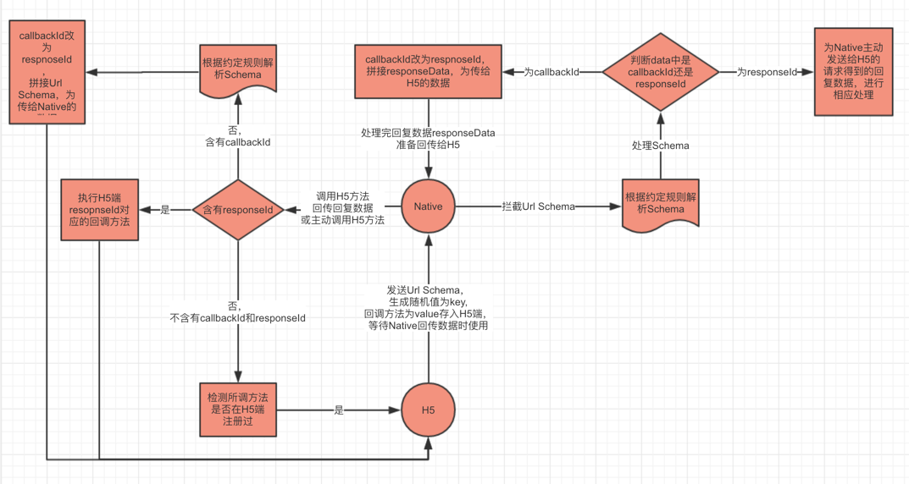

## 需求背景

如果在一个移动端的项目里，百分之八十以上都是嵌入的 H5，原生基本上只在是一个壳，并且在 H5 的业务流程中，也穿插着与 Native 的通信，不是简简单单的嵌入 H5 就足够了，这时候，就需要一个极其可靠的 H5 与 Native 的通信机制来保证 H5 和 Native 的数据交换。其次，如果 H5 不再是一个多页应用或者传统上的 MVC 架构，采用的是基于`vue`、`react`或者`ng`开发的单页应用，这时候，就需要保证在 H5 的任何地方（如组件的各个生命周期、路由等）都可能需要与原生通信。

那么，这篇文章就是用来总结刚刚在项目里遇到的这个问题，Hybird 混合开发模式下嵌入 H5 单页应用，如何保证 Native 和 H5 进行可靠的数据交换和通信？

<!--more-->

## Webview 与 H5 的通信机制

网上 Webview 与 H5 的通信机制的文章也很多，JSbridge 只是其中一种通信机制，也是较为可靠的通信机制，其它通信方式受限于 android 和 IOS 的系统版本（_因为需要了解原生的开发才能测试，暂未亲自考证过哦，只是通过网络了解的_），通过根据网络上的整理（_以后有机会亲测过后再来补充，先来占个位_），大致分为以下几种：

- 安卓通过`loadUrl`方法，IOS 通过`stringByEvaluatingJavaScriptFromString`方法可调用`window`下的全局函数。

- webview 下可通过`onJSAlert`、`onJSConfirm`、`onJsPrompt`、`shouldOverrideUrlLoading`监听到 JS 的`alert`、`confirm`、`prompt`、`location`方法。

- JSbridge,由 JS 搭建的用于与 Native 通信的桥梁。

## JSBridge 通信原理



JSBridge 是一种通信理念，Native 端的 Webview 可以拦截 H5 端的所有请求，比如普通的 http 请求:`http://xx.com?type=getToken`，H5 也可以自定义协议，需要与 Native 约定，比如：`appName://getMessage?type=getToken`，所以，H5 端需要和 Native 约定一个通信数据结构，H5 按照这种这种数据结构通过`Schema url`的形式发出，Native 捕获并按照之前双方的约定对数据结构进行解析，再通过调用 H5 暴露在全局的方法将数据回传给 H5，就完成了基础的 H5 与 Native 的数据通信。

## Url Scheme

前面说到，Native 可以捕获到所有 H5 的请求，那么 H5 该以什么样的形式发出请求呢？

- window.href="appName://getMessage?type=getToken"

- iframe.src="appName://getMessage?type=getToken"

以上两种形式都可以在前端页面发出请求，第一种为页面跳转，第二种为在页面内加入 iframe 框架，在单页应用中，不可能每次都要跳页，单页应用这种架构除了首屏加载慢的弊端，也尽量避讳跳页，因为这种情况下，如果部分视图开启了`keep-live`,或者如果有些数据状态存在了`vuex`，`redux`等这种第三方状态管理中，会导致状态数据和页面状态丢失，这显然不是所期望出现的状况。所以，第二种才是比较好的发送 Schema 的方式。

代码实现：

```
export default class JSBridge{
	constructor(){}
	//...other Methods
	createIframe(uri){
		this.messagingIframe = document.createElement('iframe');
        this.messagingIframe.style.display = 'none';
        this.messagingIframe.src = this.CUSTOM_PROTOCOL_SCHEME + '://' + this.API_Name;
        //采用iframe跳转scheme的方法
        this.messagingIframe.src = uri;
        document.documentElement.appendChild(this.messagingIframe);
        let that = this;
        setTimeout(function() {
            that.messagingIframe.remove();
        }, 100);

	}
}
```

## H5 发送 Schema url

细化**JSBridge 通信原理**一小节中的 H5 发送 Schema 的流程，H5 端在发送消息只需要以下这种形式发送即可。

```
//需要回调处理返回的数据
JSBridge.send('native监听的方法名字',{
	//这里是发送给Native的数据
	},(responseData)=>{
		//H5接收到Native回传的数据的回调方法
})
```

或

```
//不需要回调处理返回的数据
JSBridge.send('native监听的方法名字',{
	//这里是发送给Native的数据
	})
```

从上面可以接受到两个或者三个参数，分别是 Native 监听的方法名、传给 Native 的数据、Native 传回数据后 H5 端需要执行的回调方法，在`send`方法内需要做以下处理逻辑：

- 根据参数 argumens 个数，判断是否需要回调处理，需要回调，则生成一个随机数作为 key 值，回调方法作为 value 存入本地一个 callbackMethods 对象中，并将随机数作为 callbackId 的值存入传给 Native 的数据对象中。

- 根据 UA 判断当前环境是 IOS 还是安卓：

  - IOS 则将 handleName，callbackId 和 data 存入本地一个对象中，H5 提供一个方法`_fetchQueue`获取。

  - 安卓，则将 handleName,callbackId 和 data 拼成 Url，付给 iframe 的 src。

- 调用 Iframe，发出请求消息。

关键代码实现：

```
    _doSend(message, responseCallback) {
        if(responseCallback) {
            //取到一个唯一的callbackid
            let callbackId = this.getCallbackId();
            //回调函数添加到集合中
            this.responseCallbacks[callbackId] = responseCallback;
            //方法的详情添加回调函数的关键标识
            message['callbackId'] = callbackId;
        }
        let uri;
        //android中,可以通过onJsPrompt或者截取Url访问都行
        let ua = navigator.userAgent;
        if(ua.match(/(iPhone\sOS)\s([\d_]+)/)||ua.match(/(iPad).*OS\s([\d_]+)/)) {
            //ios中,通过截取客户端url访问
            //因为ios可以不暴露scheme,而是由原生手动获取
            //正在调用的方法详情添加进入消息队列中,原生会主动获取
            console.log(message);
            window[this.JSBridgeName].sendMessageQueue.push(message);
            // window[this.JSBridgeName].sendMessageQueue = message;
            uri = this.getUri();
        }else{
            //android中兼容处理,将所有的参数一起拼接到url中
            uri = this.getUri(message);
        }
        //获取 触发方法的url scheme
        //进行url scheme传值的iframe
			this.createIframe(uri);
    }

```

## IOS 获取数据消息

IOS 可调用该方法获取到 H5 发出的消息队列。

```
    /**
     * iOS专用
     * @description 当本地调用了callHandler之后,实际是调用了通用的scheme,通知原生
     * 然后原生通过调用这个方法来获知当前正在调用的方法队列
     */
    _fetchQueue() {
        // let messageQueueString = JSON.stringify(window.JSBridgeFor9AIR.sendMessageQueue);
        let message =  window.JSBridgeFor9AIR.sendMessageQueue;
        window.JSBridgeFor9AIR.sendMessageQueue = [];
        // window.JSBridgeFor9AIR.sendMessageQueue = {};
        return message;
    }

```

## Native 调用 H5/回传数据给 H5

到这里，H5 已经按照固定的数据格式通过 Schema 将数据传给了 Native，Native 拿到这些数据会将`callbackId`取出来，并将值付给 key 为`responseId`的对象，该对象内还有一个字段为`responseData`，里面存放的是 Native 回传给 H5 的数据，Native 如何将组装好的数据传给 H5 呢？

Native 可以主动调用 Window 全局下的 JS 方法，所以，在 H5 端准备一个全局可访问到的 JS 方法(\_handleMessageFromNative
)，该方法有一个参数，参数便就是 Native 组装的数据，这样就可以回传数据给 H5，该方法内对数据应该做以下处理逻辑：

- 取出 responseId,去 callbackMethods 对象取出响应的回调方法
- 将 responseData 作为该回调方法的参数传入，回调方法执行响应的处理逻辑。
- 再次发送一个不需要回调方法的 Schema,通知客户端已接收到数据。

至此，一次由 H5 发出消息->Native 接收消息并回复->H5 接收到回复消息通知 Native 接收成功的通信完成了闭环。

**是不是该贴代码了？？ 再等等，还有一个问题**

从开始到现在，所有的通信都是先由 H5 发出，由 Native 接收到并处理完之后回传给 H5，当然，并不可能所有的场景都必须要 H5 先发出，Native 也需要在一定的场景下主动调用 H5 的方法。

不管是 Native 回复 H5 的数据，还是，Native 主动调用 H5，都是通过 Native 调用 H5 暴露在 Window 下的全局方法，H5 端已经暴露出了`_handleMessageFromNative`方法供 Native 回复数据，之后只需要在这个方法内部添加逻辑，然后区分是 Native 回复数据还是主动调用 H5 的逻辑即可。

所以，该方法的处理逻辑现在变成了这样：

- 含有 responseId，说明是由 H5 端发出的通信请求，Native 处理完之后的回复数据。
- 不含有 responseId，先判断 HandleName 是否存在。
  - 含有 callbackId，说明是由 Native 主动向 H5 发出的请求，并需要回调处理，此时 H5 也需要像 Native 那样将 callbackId 改为 responseId,并加上 responseData 通过`Schema`回传给 Native。
  - 不含有 callbackId，说明是由 Native 主动向 H5 发出的请求，也不需要回调，H5 只需要根据 HandleName 处理完响应的逻辑即可。

关键代码实现：

```
    /**
     * @description 原生调用H5页面注册的方法,或者调用回调方法
     * @param {String} messageJSON 对应的方法的详情,需要手动转为json
     */
    _handleMessageFromNative(messageJSON) {
        let that = this;
        setTimeout(_doDispatchMessageFromNative);
        /**
         * @description 处理原生过来的方法
         */
        function _doDispatchMessageFromNative() {
            let message;
            // Vue.prototype.$Toast({
            //     content: messageJSON,
            //     duration:10000
            // })
            // return false;
            try {
                message = JSON.parse(messageJSON);
                // alert(message.handlerName);
                // alert(message.responseData.orgOrdst);
                // alert(message.responseId);

                // return false;
            } catch(e) {
                //TODO handle the exception
                console.error("原生调用H5方法出错,传入参数错误");
                return;
            }

            //回调函数
            let responseCallback;
            if(message.responseId) {
                console.log(that);
                //这里规定,原生执行方法完毕后准备通知h5执行回调时,回调函数id是responseId
                responseCallback = that.responseCallbacks[message.responseId];
                if(!responseCallback) {
                    return;
                }
                //执行本地的回调函数
                responseCallback(message.responseData);
                delete that.responseCallbacks[message.responseId];
            } else {
                //否则,代表原生主动执行h5本地的函数
                if(message.callbackId) {
                    //先判断是否需要本地H5执行回调函数
                    //如果需要本地函数执行回调通知原生,那么在本地注册回调函数,然后再调用原生
                    //回调数据有h5函数执行完毕后传入
                    let callbackResponseId = message.callbackId;
                    responseCallback = function(responseData) {
                        //默认是调用EJS api上面的函数
                        //然后接下来原生知道scheme被调用后主动获取这个信息
                        //所以原生这时候应该会进行判断,判断对于函数是否成功执行,并接收数据
                        //这时候通讯完毕(由于h5不会对回调添加回调,所以接下来没有通信了)
                        that._doSend({
                            handlerName: message.handlerName,
                            responseId: callbackResponseId,
                            responseData: responseData
                        });
                    };
                }

                //从本地注册的函数中获取
                let handler = that.messageHandlers[message.handlerName];
                if(!handler) {
                    //本地没有注册这个函数
                } else {
                    //执行本地函数,按照要求传入数据和回调
                    handler(message.data, responseCallback);
                }
            }
        }
    }    /**
     * @description 原生调用H5页面注册的方法,或者调用回调方法
     * @param {String} messageJSON 对应的方法的详情,需要手动转为json
     */
    _handleMessageFromNative(messageJSON) {
        let that = this;
        setTimeout(_doDispatchMessageFromNative);
        /**
         * @description 处理原生过来的方法
         */
        function _doDispatchMessageFromNative() {
            let message;
            try {
                message = JSON.parse(messageJSON);
            } catch(e) {
                //TODO handle the exception
                console.error("原生调用H5方法出错,传入参数错误");
                return;
            }

            //回调函数
            let responseCallback;
            if(message.responseId) {
                console.log(that);
                //这里规定,原生执行方法完毕后准备通知h5执行回调时,回调函数id是responseId
                responseCallback = that.responseCallbacks[message.responseId];
                if(!responseCallback) {
                    return;
                }
                //执行本地的回调函数
                responseCallback(message.responseData);
                delete that.responseCallbacks[message.responseId];
            } else {
                //否则,代表原生主动执行h5本地的函数
                if(message.callbackId) {
                    //先判断是否需要本地H5执行回调函数
                    //如果需要本地函数执行回调通知原生,那么在本地注册回调函数,然后再调用原生
                    //回调数据有h5函数执行完毕后传入
                    let callbackResponseId = message.callbackId;
                    responseCallback = function(responseData) {
                        //默认是调用EJS api上面的函数
                        //然后接下来原生知道scheme被调用后主动获取这个信息
                        //所以原生这时候应该会进行判断,判断对于函数是否成功执行,并接收数据
                        //这时候通讯完毕(由于h5不会对回调添加回调,所以接下来没有通信了)
                        that._doSend({
                            handlerName: message.handlerName,
                            responseId: callbackResponseId,
                            responseData: responseData
                        });
                    };
                }

                //从本地注册的函数中获取
                let handler = that.messageHandlers[message.handlerName];
                if(!handler) {
                    //本地没有注册这个函数
                } else {
                    //执行本地函数,按照要求传入数据和回调
                    handler(message.data, responseCallback);
                }
            }
        }
    }

```

## H5 本地注册方法

Native 主动调用 H5，需要 H5 先将方法注册到本地。
关键代码实现：

```
    /**
     * @description 注册本地JS方法通过JSBridge给原生调用
     * 我们规定,原生必须通过JSBridge来调用H5的方法
     * 注意,这里一般对本地函数有一些要求,要求第一个参数是data,第二个参数是callback
     * @param {String} handlerName 方法名
     * @param {Function} handler 对应的方法
     */
    registerHandler(handlerName, handler) {
        this.messageHandlers[handlerName] = handler;
    }


```

## JSbridge 整合到单页应用 SPA

以上部分，已完成了 H5 和 Native 的数据双向通信，JSBridge 在单页应用中，可能需要在不同的地方发出通信请求，比如说：每个路由页面、单个组件内部各个生命周期、路由钩子等。这里，以基于 Vue 构建的单页应用为例。

在 Vue 构建的单页应用中，整个单页应用基本上都只有一个 Vue 实例，还记得在 Vue 中使用`axios`,可以在每个组件内这样发出请求:

```
 this.$http.post('api_url',{
 	//请求参数
 })
 .then((res)=>{
 	//返回数据处理
 })
 .catch((err)=>{
 	//错误处理
 })

```

所以，也按照这种形式整合进来，首先在应用入口的位置，我们生成一个 JSBridge 实例，在`new Vue`实例之前，将该实例绑定到 Vue 的`prototype`，这样便可以在每个整个应用内任何组件的 this 的原型访问到 JSBridge 实例。

关键代码：

```
import WebviewBridge from './utils/WebviewBridge';
const WB = new WebviewBridge();
// 绑定Bridge到原型
Object.defineProperty(Vue.prototype,'$bridge',{value:WB})

```

这样，便可以在单页应用中的组件内部获取到 JSBridge 实例，便可以像 axios 那样发出请求：

```
 this.$bridge.callHandler('方法名',{
     //参数
 },(res)=>{
	//回调逻辑
 })

```

如果，还需要在路由钩子中发出请求，只需要将 WB 对象引入到路由配置文件即可。
