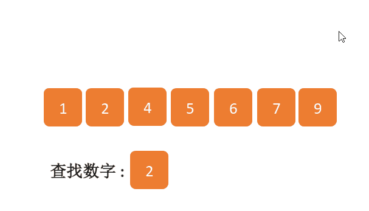

## 前言

二分查找（Binary Search) 是一种效率较高的查找方法，二分查找也称为折半查找。在面试或算法竞赛中，查找相关的问题最优解通常就是二分查找；如果一个查找问题能够用一个条件消除一半的查找区域，那么就对目标在特定空间搜索，从而减少查找空间。虽然二分查找思路比较直观，但大部分面试者通常在边界处理的时候考虑不全，从而出错。有很多原因导致二分查找处理边界失败！例如，当目标位于数组第 0 个索引时，或位于第(n - 1)个索引时，程序进入死循环。

## 动画演示



## 实现

```js
function binarySearch(arr, target) {
  var h = arr.length - 1,
    l = 0;
  while (l <= h) {
    var m = Math.floor((h + l) / 2);
    if (arr[m] == target) {
      return m;
    }
    if (target > arr[m]) {
      l = m + 1;
    } else {
      h = m - 1;
    }
  }

  return false;
}
```
