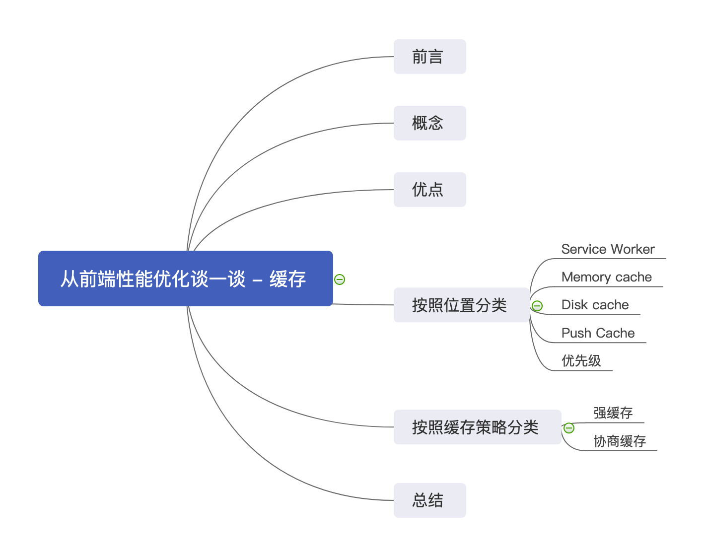
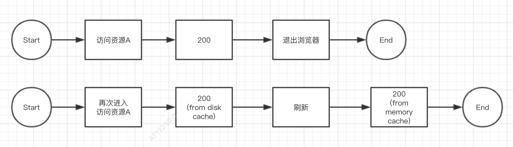

谈到 WEB 性能优化，这本身是一个很 "大" 的话题。依稀记得几年前初入前端时，业界曾盛行流传的 “ 雅虎 35 条军规 ”，还有通过雪碧图来减少浏览器的请求数量，再有通过语义化的方式对前端代码的编写来提升 SEO 的优化等等，这些都是针对前端性能的优化策略。再到近些年 `Node.js`的横空出世，`ES` 规范的普及，前端工程化、模块化的大行其道，很多基础的性能优化策略逐渐被工具所替代，我们似乎从刀耕火种的年代中解放了出来。

<!--more-->

然而，我们依然面临着新的性能优化的方向，比如：

- 如何规避页面的回流与重构
- 如何合理的模块化代码并打包
- 如何配置构建工具提升打包效率
- 如何解决页面首次加载白屏问题
- 如何利用缓存提升优化 WEB 性能
- 等等...

由此看来，我们可以从渲染层、构建层、网络层等多个维度出发，提出诸多优化的方向。在这里，我们无法通过一篇文章涵盖到所有的技术点。本次，我们将会以 HTTP 层为切入点，谈一谈我们似懂非懂的 --- **HTTP 缓存**。缓存是在前端性能优化中简单而又高效的优化策略之一，希望通过这篇文章能够涵盖 HTTP 缓存相关知识的方方面面。本文内容大致如下：



## 概念

引用维基百科中的定义：

> Web 缓存（或 HTTP 缓存）是用于临时存储（缓存）Web 文档（如 HTML 页面和图像），以减少服务器延迟的一种信息技术。Web 缓存系统会保存下通过这套系统的文档的副本；如果满足某些条件，则可以由缓存满足后续请求。Web 缓存系统既可以指设备，也可以指计算机程序。

提到缓存在 WEB 开发中的应用，通常有：

- 数据库缓存
- DNS 缓存
- 代理服务器缓存
- 浏览器缓存

甚至，在应用层面，我们还可以通过 JS 的闭包方式缓存到本地一个变量，比如：在单例设计模式中只会缓存并保留一个实例。

## 优点

引用 Chrome 在性能优化方面给出的建议：

> 通过网络提取内容既速度缓慢又开销巨大。 较大的响应需要在客户端与服务器之间进行多次往返通信，这会延迟浏览器获得和处理内容的时间，还会增加访问者的流量费用。 因此，缓存并重复利用之前获取的资源的能力成为性能优化的一个关键方面。

由此，我们可以加以总结出以下几点：

- **加快了页面的渲染和呈现，提升了用户体验和 WEB 性能。**
- **减少了冗余的数据传输，节省了服务器带宽和流量。**
- **尤其在高并发、大流量的场景下，降低了对原始服务器的负担。**

## 按照位置分类

### Service Worker

Service Workers 本质上充当 Web 应用程序与浏览器之间的代理服务器，也可以在网络可用时作为浏览器和网络间的代理。它们旨在能够创建有效的离线体验，拦截网络请求并基于网络是否可用以及更新的资源是否驻留在服务器上来采取适当的动作。同时，出于安全的考量，它只能由线上 HTTPS 或本地 localhost 承载。

#### 与缓存相关的特性

- 独立于浏览器主线程之外，可以控制页面所有的请求。
- 被 install 后就永远存在，除非被手动卸载。
- 可以通过 fetch api ，来拦截网络和处理网络请求，配合 cacheStorage 来实现 WEB 页面的缓存管理。

#### 注册 service worker

```javascript
// 检测浏览器是否支持 serviceWorker API
if ("serviceWorker" in navigator) {
  navigator.serviceWorker
    .register("/sw.js")
    .then(function (registration) {
      // 注册成功
      console.log(
        "ServiceWorker registration successful with scope: ",
        registration.scope
      );
    })
    .catch(function (err) {
      // 注册失败
      console.log("ServiceWorker registration failed: ", err);
    });
}
```

#### 安装

```javascript
// 缓存文件的版本
const VERSION = "v1";
// 需要缓存的页面文件
const CACHE_FILES = ["js/app.js", "css/style.css"];
// self 是在 Service Worker 下的全局 API
self.addEventListener("install", function (event) {
  // 监听worker的install事件
  event.waitUntil(
    // 延迟install事件直到缓存初始化完成
    new Promise(function () {
      //Cache 和 CacheStorage 都是 Service Worker API 下的接口
      //我们可以直接使用全局的 caches 属性访问 CacheStorage
      caches.open(VERSION).then(function (cache) {
        console.log("Opened cache");
        return cache.addAll(CACHE_FILES);
      });
      //更新sw时,跳过waiting
      self.skipWaiting();
    })
  );
});
```

如果所有的文件都缓存成功，Service worker 就安装成功了。如果任何一个文件下载失败，那么安装步骤就会失败。这个方式依赖于你自己指定的资源，但这意味着，你需要非常仔细地确定哪些文件需要被缓存。指定了太多文件的话，会增加失败率。

#### 缓存更新

```javascript
self.addEventListener("activate", function (event) {
  event.waitUntil(
    caches.keys().then(function (cacheNames) {
      return Promise.all(
        cacheNames.map(function (cacheName) {
          // 如果当前版本和缓存版本不一致
          if (cacheName !== VERSION) {
            return caches.delete(cacheName);
          }
        })
      );
    })
  );
});
```

#### 拦截请求

```javascript
//在fetch事件里能拦截网络请求，进行一些处理
self.addEventListener("fetch", function (event) {
  event.respondWith(
    caches.match(event.request).then(function (response) {
      // 如果匹配到缓存里的资源，则直接返回
      if (response) {
        return response;
      }
      return fetch(request).then(function (httpRes) {
        //拿到了http请求返回的数据，进行一些操作
        //请求失败了则直接返回、对于post请求也直接返回，sw不能缓存post请求
        if (
          !httpRes ||
          (httpRes.status !== 200 &&
            httpRes.status !== 304 &&
            httpRes.type !== "opaque") ||
          request.method === "POST"
        ) {
          return httpRes;
        }

        // 请求成功的话，将请求缓存起来。
        var responseClone = httpRes.clone();
        caches.open("my-first-sw").then(function (cache) {
          cache.put(event.request, responseClone);
        });

        return httpRes;
      });
    })
  );
});
```

### Memory cache

Memory cache 指的是从内存中读取资源，与之相对的是 Disk cache（磁盘缓存），资源文件是否会被放入到内存中，取决于当前内存的空闲情况，如果内存使用率低就会放入内存中，反之则会放入到磁盘中；另外一种情况是，目前为强缓存 no-store 时（强缓存的概念在后面的章节会提到），它会忽略内存中缓存的资源文件，重新向服务端发起资源请求。它的优点是读取速度很快，同一个缓存资源可以跨站点共享，它的可用时效性是在内存中进程被 Kill 掉时便失效，对应到浏览器中，就是当用户退出浏览器的操作时会失效。

以某个资源 A 为例，它的缓存过程应该如下：



### Disk cache

Disk cache 是与 Memory cache 相对的缓存，顾名思义，就是将资源缓存到磁盘中，对磁盘进行 I/O 操作，等待下次访问时不需要重新下载资源，而直接从磁盘中获取，它的直接操作对象为 CurlCacheManager。它与 Memory cache 最大的区别在于，当退出进程时，内存中的数据会被清空，而磁盘的数据不会，所以，当下次再进入该进程时，仍可以从 Disk cache 中获得数据，它的存储是持久的，而 Memory cache 则不行。

### Push Cache

简而言之，HTTP/2 中的 Server Push 技术使得服务端收到页面请求后，能够将页面所需资源通过 PUSH_PROMISE 帧推送给浏览器，从而减少延迟。

举个栗子：假设发送一个页面的请求到服务端，页面中还包含一些其它的静态资源请求（css、js、图片等），在 HTTP/1.0 或者 HTTP/1.1 中，多个资源会发送多个请求，而在 HTTP/2 中，服务端可以通过 Server Push 在接收到首个请求后将相关资源推送到浏览器。

### 优先级

按照浏览器的缓存的优先命中顺序，如下：

- Service Worker
- Memory Cache
- Disk Cache
- Push Cache

最终，全部没有命中的情况下，才会向服务端请求新的资源。

## 按照失效策略分类

### 强缓存

强缓存是指用户在第一次请求之后，在一定的有效时间之内不会再次请求服务端，会直接从缓存（Service Worker 、Memory cache 、Disk cache）中读取，所以，强缓存的关键就在于有效时间的判定，对于有效时间的判定，HTTP/1.0 和 HTTP/1.1 是不同的，分别为 Expires 和 Cache-control。

#### Expires

Expires 是 HTTP 1.0 用于控制强制缓存的字段，表示该缓存资源的有效期时间，它由当前时间和有效期时间构成，是一个未来的时间点（时间戳），我们给它一个快照：

```javascript
Expires: Sun, 08 Dec 2019 16:51:51 GMT
```

但是，他会存在两个弊端：

- 因为用户的本地时间和服务端时间不同，会导致有效时间设置存在误差。
- 因为 Expires 值的写法要求严格，多一个空格或者少一个字都会导致设置无效。
- 本地时间也可能会被用户手动修改，造成有效时间上判定的误差。

所以，在 HTTP/1.1 中，又新增了一个字段 Cache-control，它主要为了解决了上面提到的两个问题。

#### Cache-control

在 HTTP/1.1 版本中，新增一个字段叫 Cache-control，它对应有几个值，如下：

| 值        | 说明                                                                                                                                                 |
| --------- | ---------------------------------------------------------------------------------------------------------------------------------------------------- |
| public    | 表明响应可以被任何对象（包括：发送请求的客户端，代理服务器，等等）缓存，即使是通常不可缓存的内容（例如，该响应没有 max-age 指令或 Expires 消息头）。 |
| private   | 表明响应只能被单个用户缓存，不能作为共享缓存（即代理服务器不能缓存它）。私有缓存可以缓存响应内容。                                                   |
| no-cache  | 在发布缓存副本之前，强制要求缓存把请求提交给原始服务器进行验证。                                                                                     |
| no-store  | 缓存不应存储有关客户端请求或服务器响应的任何内容。                                                                                                   |
| max-age   | 设置缓存存储的最大周期，超过这个时间缓存被认为过期(单位秒)。与 Expires 相反，时间是相对于请求的时间。                                                |
| s-maxages | 覆盖 max-age 或者 Expires 头，但是仅适用于共享缓存(比如各个代理)，私有缓存会忽略它。                                                                 |
| max-stale | 表明客户端愿意接收一个已经过期的资源。可以设置一个可选的秒数，表示响应不能已经过时超过该给定的时间。                                                 |
| min-fresh | 表示客户端希望获取一个能在指定的秒数内保持其最新状态的响应。                                                                                         |

我们给 max-age 一个快照，如下：

```javascript
Cache-Control: max-age=10800
```

在 HTTP/1.1 版本环境下，为了做兼容的处理，一般会同时设定 Expires 和 Cache-control，在两个同时存在时，Expires 的优先级会高于 Cache-control，由上面可以看出 Cache-Control 的 max-age 代表的是一个相对时间，Expires 是一个绝对时间，max-age 设置为 0 的话，则代表资源立即过期；同时，Cache-control 的取值还可以将表格中的取值混合搭配。

最后，我们借用 Chrome 的一张图 ([图片来源](https://developers.google.com/web/fundamentals/performance/optimizing-content-efficiency/http-caching?hl=zh-CN))，来描述一下 Cache-control 取值的优先级：


### 协商缓存

在上一小节的强制缓存中，我们通过设置了一个时间点来判定了资源是否有效，但是，当资源过期，也就是强制缓存没有命中的时候，我们需要知道文件是否发生修改，来决定是否需要向服务端重新获取资源，这个时候，就需要协商缓存策略来大显身手了。

我们可以想象，在资源没有命中强制缓存之后，浏览器是无法知道资源是否是最新的，所以，浏览器需要向服务端询问是否需要更新缓存资源，那么服务端接收到请求后，是根据什么判别资源是否是最新的呢？

这里，会涉及到两组字段（注意是两组，不是两个），他们分别是：

- Last-Modified 和 If-Modified-Since
- ETag 和 If-None-Match

#### Last-Modified 和 If-Modified-Since

结合一个资源请求的示例来说明这两个字段：

- 在浏览器打开一个页面，浏览器第一次请求该资源，服务端返回资源，状态码为 200，并在返回资源的响应头中加入 Last-Modified 字段，这个字段表示这个资源在服务器上的最近修改时间。
- 浏览器接收到状态码为 200 的资源，记录 Header 中的 Last-Modified 字段。
- 浏览器再次向服务端发送该资源的请求时，请求头会加上 If-Modified-Since 的 header，这个 If-Modified-Since 的值正是上一次请求该资源时，服务端返回的 Last-Modified 响应头值。
- 服务端再次收到请求，根据请求头 If-Modified-Since 的值，判断相关资源是否有变化；如果没有变化则返回 304 Not Modified，且并不返回资源内容，浏览器使用资源缓存值；如果有变化，则正常返回资源内容，且更新 Last-Modified 响应头内容。

同时，Last-Modified 和 If-Modified-Since 存在一些潜在的问题：

- 与 Expires 类似，时间戳会同样存在一定的不可靠性。
- 时间点只能精确到秒级，无法精确到毫秒级，假设在一秒内修改多次，只会记为一次。
- 无法检测资源内容是否真正的修改，

#### ETag 和 If-None-Match

面对在 Last-Modified 和 If-Modified-Since 中产生的一些潜在的问题，在 HTTP/1.1 中，又新增了 ETag 和 If-None-Match 字段。

ETag 是针对文件内容生成的唯一值，它能像指纹或者 Hash 一样精确，同时能精确到毫秒级，解决了 Last-Modified 的痛点。同样，ETag 和 Last-Modified 也可以同时存在，同时存在的条件下，ETag 的优先级比 Last-Modified 更高。

## 总结

本次，我们梳理了 HTTP 缓存在前端开发中的应用场景及知识点，对于缓存的相关应用，还有：

- 数据存储： Cookie、Storage、IndexedDB
- App Cache 、 Manifest

这些不是本文的重点，有需要可自行查阅。此外，**对于 HTTP 为 200 的状态码的资源请求，我们又可以再次细分。如下：**

- **from ServiceWorkers**
- **from memory cache**
- **from disk cache**
- **从服务端拉取的新资源**

最后，本文梳理的知识点，部分欠缺项目实践过程中的支撑，遗漏或者有问题的部分，欢迎指出。

## 参考文献

- [service worker 静态资源离线缓存实践](https://juejin.im/post/5d33d3a6f265da1bc94f29a6)
- [前端必须要懂的浏览器缓存机制](https://github.com/zuopf769/notebook/blob/master/fe/%E5%89%8D%E7%AB%AF%E5%BF%85%E9%A1%BB%E8%A6%81%E6%87%82%E7%9A%84%E6%B5%8F%E8%A7%88%E5%99%A8%E7%BC%93%E5%AD%98%E6%9C%BA%E5%88%B6/README.md)
- [浅谈 Web 缓存](http://www.alloyteam.com/2016/03/discussion-on-web-caching/)
- [service worker 静态资源离线缓存实践](https://juejin.im/post/5d33d3a6f265da1bc94f29a6)
- [google 官方相关文档](https://developers.google.com/web/fundamentals/performance/optimizing-content-efficiency/http-caching?hl=zh-CN)
